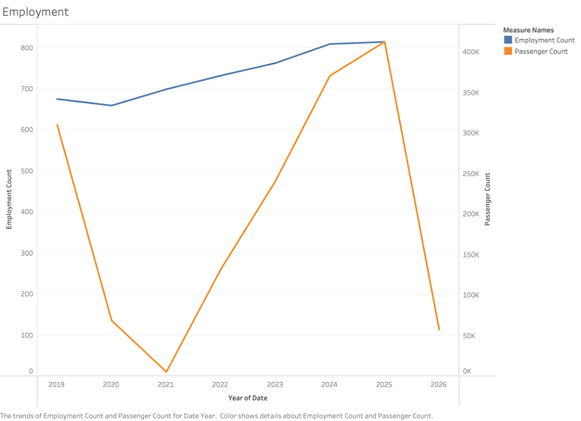
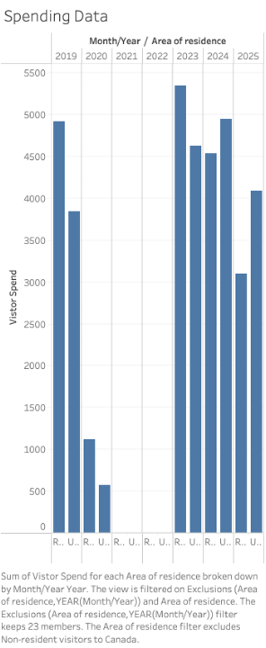
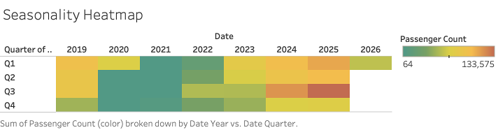
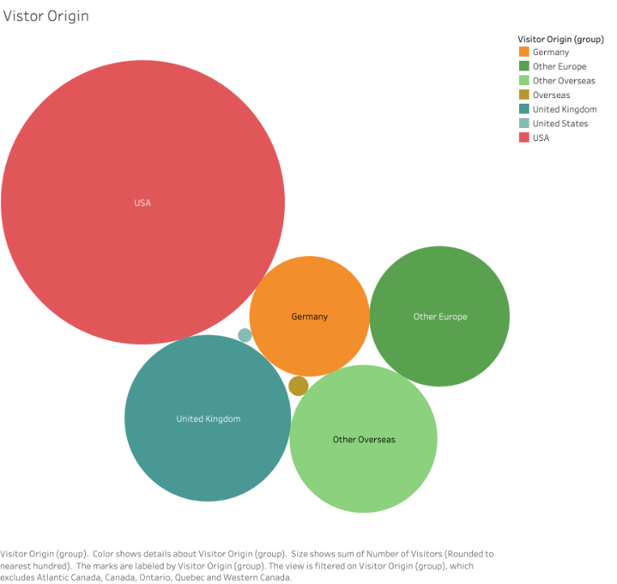

# 1. Project Title and Decision Statement
Strategic growth analysis for Halifax International Airport Authority(HIAA): Evaluating investment tradeoffs between seasonal European tourism and year-round flights to the US.

### Decision Statement
*Should the Senior Leadership Team of the Halifax International Airport Authority (HIAA) prioritize incentive funding for seasonal European expansion to boost high-value tourism, or focus on year-round transborder connectivity to ensure regional economic stability?*

# 2. Executive Summary

Following a period of significant expansion, Halifax Stanfield (YHZ) recently reached a milestone of **4.1 million annual passengers**, signaling a robust new growth phase for Atlantic Canada’s primary gateway (HIAA, 2026). This momentum is driven by two distinct market trends: a **19.3% surge** in international travelers, fueled by seasonal transatlantic expansion, and an **8.5% increase** in transborder (U.S.) traffic, supported by the entry of new year-round jet services (HIAA, 2026; Tourism Nova Scotia, 2025).

The airport’s Senior Leadership Team faces a recurring strategic choice regarding the allocation of limited air service incentive funding for future growth phases. While high-capacity seasonal flights to Europe generate massive economic impact—with air travelers spending an average of **$1,224 per person** they can lead to underutilized infrastructure during off-peak months (Tourism Nova Scotia, 2024). Conversely, year-round transborder routes offer greater economic stability and consistent local employment but typically operate on lower immediate margins per passenger (HIAA, 2025).

This project analyzes which investment strategy best supports Nova Scotia’s long-term economic resilience. By evaluating the trade-offs between seasonal "value" and year-round "volume," this analysis provides a data-driven framework to help HIAA leadership maximize the airport’s regional economic contribution in upcoming strategic cycles.

# 3. Table of Contents
1. [Project Title and Decision Statement](#1-project-title-and-decision-statement)
2. [Executive Summary](#2-executive-summary)
3. [Table of Contents](#3-table-of-contents)
4. [Background](#4-background)
5. [Data Sources](#5-data-sources)
6. [Exploratory Findings](#6-exploratory-findings)
7. [System Dynamics](#7-system-dynamics)
8. [Analysis](#8-analysis)
9. [Recommendations](#9-recommendations)
10. [Limitations and Future Work](#10-limitations-and-future-work)
11. [References](#11-references)

# 4. Background
### Why This Decision Matters: The Economic Stakes

Halifax Stanfield International Airport (YHZ) serves as the primary economic gateway for Atlantic Canada and a critical engine for regional prosperity. Recently, the airport reached a landmark milestone of 4.1 million annual passengers, signaling the beginning of a robust new growth phase for the region. For the Senior Leadership Team (SLT) of the Halifax International Airport Authority (HIAA), this growth presents a complex management challenge. The stakes are exceptionally high because air service development is not a passive occurrence; it requires the strategic allocation of "incentive funding"—which includes financial subsidies, marketing support, or landing fee waivers—to attract and retain airlines in a competitive global market.

Because these financial resources are finite, the SLT must choose where to place its bets. A strategic misstep in this allocation could lead to significant negative consequences, such as underutilized infrastructure during off-peak months or a lack of the consistent, year-round connectivity that Nova Scotian businesses require for long-term stability. This decision effectively determines the airport’s role in the regional economy for the next strategic cycle.

### Tensions and Trade-offs: The Difficulty of the Choice

The core difficulty of this decision lies in a fundamental trade-off between seasonal "value" and year-round "volume." This choice is non-obvious because both paths offer distinct advantages and significant risks.

On one hand, prioritizing seasonal European expansion targets high-capacity transatlantic flights during the peak summer months. These routes are incredibly lucrative for the province, as international air travelers spend an average of $1,224 per person, providing a massive seasonal injection into the hospitality and tourism sectors. However, this model creates "peak-load" issues. The airport must maintain infrastructure and staffing levels capable of handling these summer surges, which then sit underutilized during the winter months, leading to operational inefficiencies and seasonal employment volatility.

On the other hand, focusing on year-round transborder (U.S.) connectivity provides the economic "connective tissue" for the region. These routes support consistent business travel, specialized cargo logistics, and reliable regional employment that does not disappear when the leaves change. While these flights offer greater regional economic resilience, they typically operate on lower immediate profit margins per passenger compared to high-spending European "bucket list" tourism. The SLT is forced to navigate the tension between a short-term, high-value tourism spike and long-term, steady-state economic stability.

### Context: Previous Approaches and Current Challenges

Historically, HIAA has pursued a diversified "all-of-the-above" strategy, attempting to grow all sectors simultaneously. However, in the post-2025 landscape, this approach is becoming unsustainable. While international travel has surged by 19.3% and transborder traffic has increased by 8.5%, the airport is reaching its physical capacity limits during peak periods. With incentive funds limited and infrastructure nearing its maximum summer load, the SLT can no longer afford to be everything to everyone. They must now decide whether to double down on the high-value summer market or pivot their investment to secure the year-round hub access that keeps the Nova Scotian economy resilient throughout the entire year.

---
# 5. Data Sources

This directory contains the raw data files required for the HIAA Strategic Growth Analysis. These datasets provide the evidence for the "Value vs. Volume" trade-off between seasonal European tourism and year-round transborder connectivity.

---

#### 1. Monthly Screened Passenger Data (2019-2026).csv
* **Source:** Statistics Canada. Table 23-10-0312-01 Screened passenger traffic at the largest airports in Canada.
* **Date Accessed:** April 6, 2026
* **Usage Restrictions:** Statistics Canada Open Licence
* **Description:** This dataset provides monthly counts of screened passengers at Halifax Stanfield (YHZ), broken down by sector (Domestic, Transborder, and Other International). It is used to analyze growth trends and seasonality patterns.

#### 2. Visitor Spending Data.csv
* **Source:** Statistics Canada. Table 24-10-0066-01 Visits, nights and spending for visitors to Canada by geography of visit, residency and mode of transport.
* **Date Accessed:** April 6, 2026
* **Usage Restrictions:** Statistics Canada Open Licence
* **Description:** Quarterly data detailing the total and average spending of non-resident visitors to Nova Scotia. This allows for a comparison between the economic "Value" of Overseas (European) vs. U.S. visitors arriving by air.

#### 3. Tourism Nova Scotia Visitation (By Origin and Mode).csv
* **Source:** Open Data Nova Scotia / Tourism Nova Scotia.
* **Date Accessed:** April 6, 2026
* **Usage Restrictions:** Open Government Licence - Nova Scotia
* **Description:** Monthly visitation data for Nova Scotia categorized by origin (e.g., UK, Germany, USA regions) and mode of entry. This data is filtered for "Air" arrivals to isolate passengers relevant to HIAA operations.

#### 4. Halifax Employment Data.csv
* **Source:** Statistics Canada. Table 14-10-0466-01 Employment characteristics by economic region, annual.
* **Date Accessed:** April 6, 2026
* **Usage Restrictions:** Statistics Canada Open Licence
* **Description:** Annual employment statistics for the Halifax economic region. This dataset provides the evidence for the "Regional Economic Stability" variable in the Causal Loop Diagram (CLD).

# 6. Exploratory Findings

## Project Overview
This project analyzes the recovery and trends within the aviation and tourism sectors, specifically focusing on the relationship between industry employment, passenger volume, and international visitor spending.

---

## Visualizations & Insights

### 1. Employment vs. Passenger Traffic Trends

**Insight:** 
This visualization tracks the correlation between the industry's labor force and actual passenger volume. Both metrics saw a significant decline beginning in 2020,due to the Covid-19 Pandemic. While Employment Count (blue) has shown a steady, linear recovery through 2025, Passenger Count (orange) exhibited a more aggressive surge in 2024 and 2025. The sharp decline shown in 2026 likely reflects year-to-date data rather than a projected collapse. This data focuses on the Halifax region of Nova Scotia. It would be useful to see the monthly metrics for seasonality of employment, however those metrics were unavailable in the dataset.

### 2. Visitor Spending Patterns
 

**Insight:** This bar chart highlights the economic impact of visitors based on their area of residence. After a substantial data gap in 2021 and 2022 (largely due to travel restrictions and reporting exclusions), visitor spending rebounded strongly in 2023. The data indicates that spending levels in the post-recovery period have remained consistent with, or exceeded, pre-pandemic levels from 2019, showing high resilience in travel budgets.

### 3. Passenger Seasonality Heatmap
 

**Insight:** The heatmap provides a granular look at when travel peak periods occur. Quarter 3 (Q3) consistently emerges as the high-traffic season, indicated by the warmer red and orange tones. The "cool" green block across all quarters in 2021 illustrates the total cessation of standard travel patterns. By 2024 and 2025, we see a return to intense seasonality, with Q3 remaining the most critical period for passenger volume.

### 4. Visitor Origin Analysis

**Insight:** This packed bubble chart illustrates the primary source markets for tourism. The United States represents the largest single share of visitors by a significant margin. Outside of North America, the United Kingdom, Germany, and Other European countries constitute the core international demographic. This distribution suggests that marketing and infrastructure efforts are most heavily influenced by the needs and trends of the American traveler.

---

# 7. Systems Dynamics 

### Initial CLD Diagram 

---

# 8. Analysis

## Systems Analysis of HIAA Strategic Growth

### 1. System Archetype Identification
**Chosen Archetype:**  Shifting the Burden

In the HIAA context, there is a constant pressure to meet aggressive revenue and passenger growth targets.

**The Symptom:** The need for rapid economic impact and high-value revenue.

**The Symptomatic Fix (Quick Fix):** Prioritizing incentive funding for high-capacity, seasonal European flights. These provide a "surge" in high-spending tourists (avg. $1,224 per person) but only during peak months.

**The Fundamental Solution:** Investing in year-round transborder (U.S.) connectivity. This builds a stable, predictable economic baseline that supports permanent, year-round employment in the province.

**The Side Effect (The Burden):** By relying on the "symptomatic fix" of seasonal peaks, the system unintentionally undermines the stability of employment. Seasonal volatility makes tourism careers less viable for professionals, leading to high turnover and a reliance on transient labor, which ultimately threatens the long-term service quality and "viability" of the tourism product itself.

**Evidence from Data**

The Seasonality Heatmap shows an extreme concentration of traffic in Q3. Furthermore, the Employment vs. Passenger Traffic visualization shows that while passenger counts have surged aggressively, industry employment has only recovered at a slow, linear pace. This suggests that the "seasonal surge" strategy is not translating into a robust, scalable workforce, confirming that the current structure favors volatility over stability.

### 2. Scenario Narratives
**Scenario 1: Status Quo (Continued Seasonal Prioritization)**

Over the next 5-10 years, HIAA continues to prioritize seasonal European routes. Passenger volumes in Q3 continue to break records, but the provincial tourism workforce remains transient. Because employment is not year-round, skilled workers migrate to more stable sectors. By 2030, the "viability" of the tourism sector is compromised by a permanent service-quality gap during the summer rush, as local businesses struggle to find experienced staff for only four months of work.

**Scenario 2: Intervention A (The "Stability" Pivot)**

HIAA shifts 70% of incentive funding to year-round transborder routes. While the "immediate margin" per passenger is lower, the year-round volume allows provincial hotels and tour operators to offer permanent, full-time positions. Quantitatively, this reduces the "volatility gap" in the heatmap. A more professional, stable workforce emerges, leading to higher repeat-visitor rates because the quality of the Nova Scotian experience remains high and consistent in all twelve months.

**Scenario 3: Intervention B (Shoulder-Season Strategy)**

HIAA implements a "Hybrid" incentive model that rewards airlines for expanding the "shoulder seasons" (May/June and Sept/Oct). This intervention aims to "stretch" the high-value seasonal peak. By extending the viability of tourism activity into six or seven months instead of three, the system creates a "bridge" to year-round employment stability. This allows the province to capture "high-value" European spend while providing a more sustainable employment window for local workers.

### 3. Leverage Point Analysis
The most effective leverage point is redefining the "Incentive Success Metric" from Total Passenger Volume to Total Year-Round Seat Capacity.

**Why high impact:** Currently, the system incentivizes "peaks." By shifting the goal to "year-round capacity," HIAA forces a structural change in how airlines plan their routes, which directly stabilizes the downstream provincial labor market.

**Feedback loops affected:** This strengthens the Fundamental Solution in the Shifting the Burden archetype, reducing the long-term "burden" of seasonal instability.

**Risks:** Short-term revenue might dip as high-capacity summer charters are deprioritized for smaller, consistent year-round regional jets.

### 4. Implications for the Decision
The analysis reveals that while seasonal European flights provide an immediate "high-value" boost, they contribute to a cycle of seasonal instability that may eventually undermine the viability of Nova Scotia’s tourism product. Evidence from the heatmap and employment trends suggests that the "surge" in passengers is not being matched by a surge in workforce professionalization.

The option to focus on year-round transborder connectivity looks more promising for long-term regional economic resilience. Although these routes operate on lower immediate margins, they provide the "stability" necessary to sustain a viable, professionalized tourism industry. Key uncertainties remain regarding how many seasonal workers would actually transition to full-time roles if they were available. My recommendation in Milestone 4 will likely favor a balanced approach that protects the "value" of Europe while aggressively stabilizing the "volume" of the U.S. transborder market to ensure provincial employment remains viable.

---

# 9. Recommendations 

---

# 10. Limitations and Future Work 

---

## 11. References

Halifax International Airport Authority. (2026). *Annual Passenger Statistics and Regional Growth Outlook*. HIAA Newsroom. 

Halifax International Airport Authority. (2025). *Strategic Plan: Connecting Nova Scotia to the World*. HIAA Corporate Publications.

Tourism Nova Scotia. (2025). *Tourism Performance Indicators: Annual Visitation Report*. Government of Nova Scotia.

Tourism Nova Scotia. (2024). *Visitor Travel Survey: Air Traveler Spend and Behavior Analysis*. Government of Nova Scotia.
