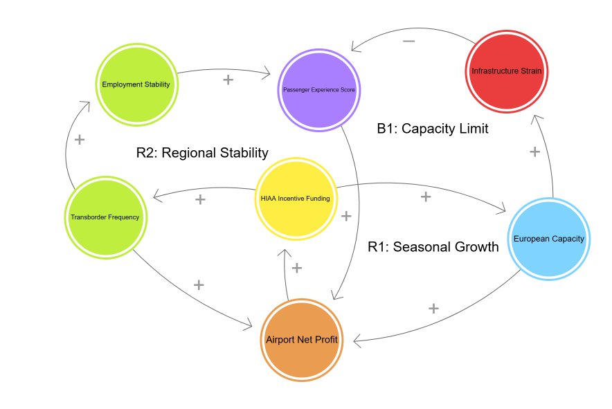

# HIAA-Strategic-Growth-Analysis
Strategic growth analysis for Halifax International Airport Authority(HIAA): Evaluating investment tradeoffs between seasonal European tourism and year-round flights to the US.

## Decision Statement
**Should the Senior Leadership Team of the Halifax International Airport Authority (HIAA) prioritize incentive funding for seasonal European expansion to boost high-value tourism, or focus on year-round transborder connectivity to ensure regional economic stability?**

## Executive Summary

Following a period of significant expansion, Halifax Stanfield (YHZ) recently reached a milestone of **4.1 million annual passengers**, signaling a robust new growth phase for Atlantic Canada’s primary gateway (HIAA, 2026). This momentum is driven by two distinct market trends: a **19.3% surge** in international travelers, fueled by seasonal transatlantic expansion, and an **8.5% increase** in transborder (U.S.) traffic, supported by the entry of new year-round jet services (HIAA, 2026; Tourism Nova Scotia, 2025).

The airport’s Senior Leadership Team faces a recurring strategic choice regarding the allocation of limited air service incentive funding for future growth phases. While high-capacity seasonal flights to Europe generate massive economic impact—with air travelers spending an average of **$1,224 per person**—they can lead to underutilized infrastructure during off-peak months (Tourism Nova Scotia, 2024). Conversely, year-round transborder routes offer greater economic stability and consistent local employment but typically operate on lower immediate margins per passenger (HIAA, 2025).

This project analyzes which investment strategy best supports Nova Scotia’s long-term economic resilience. By evaluating the trade-offs between seasonal "value" and year-round "volume," this analysis provides a data-driven framework to help HIAA leadership maximize the airport’s regional economic contribution in upcoming strategic cycles.

---

## References

Halifax International Airport Authority. (2026). *Annual Passenger Statistics and Regional Growth Outlook*. HIAA Newsroom. 

Halifax International Airport Authority. (2025). *Strategic Plan: Connecting Nova Scotia to the World*. HIAA Corporate Publications.

Tourism Nova Scotia. (2025). *Tourism Performance Indicators: Annual Visitation Report*. Government of Nova Scotia.

Tourism Nova Scotia. (2024). *Visitor Travel Survey: Air Traveler Spend and Behavior Analysis*. Government of Nova Scotia.
